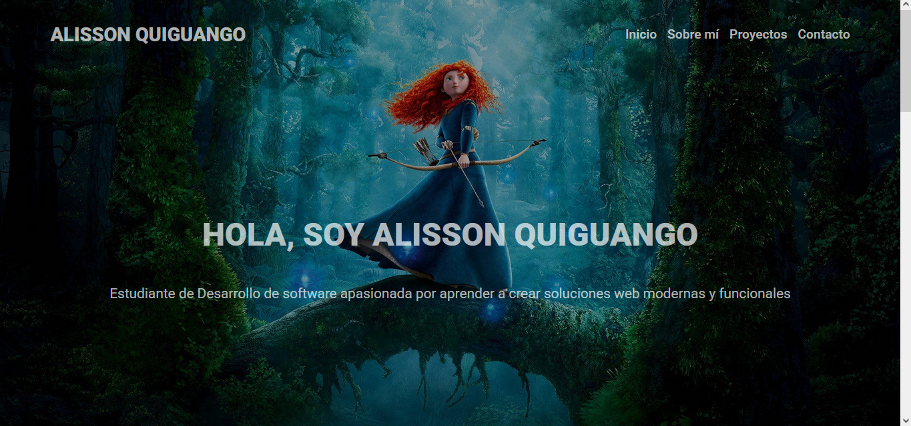

# 🌐 Portafolio Personal — Alisson Quiguango

Portafolio web personal desarrollado con React y Vite.

## 🔗 Demo
[Ver portafolio en Netlify](https://portafolio-alisson-quiguango.netlify.app/)

## 🛠️ Tecnologías usadas
- React
- Vite
- CSS3
- JavaScript

## 📁 Estructura del proyecto
```
src/
├── components/
│   ├── header/
│   ├── main/
│   ├── about/
│   ├── project/
│   └── contact/
└── assets/
```

## ⚙️ Cómo correr el proyecto
```bash
npm install
npm run dev
```

## 📌 Secciones
- **Inicio** — Presentación
- **Sobre mí** — Información personal
- **Proyectos** — Aquí Nomás
- **Contáctame** — Redes sociales

## 📸 Vista previa


## 👩‍💻 Autora
Alisson Quiguango — [@loorenna](https://github.com/loorenna)
